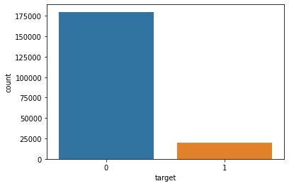
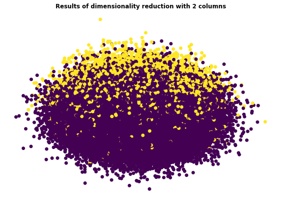
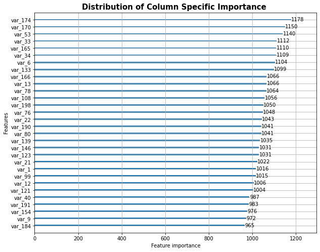

# Customer_transaction-prediction

Данный репозиторий представляет собой решение соревнования на платформе kaggle: https://www.kaggle.com/competitions/santander-customer-transaction-prediction/ 
(Public Score: 0.89427, Private Score: 0.89146)
В репозитории содержится код исследования данных в файле mywork.ipnb, а также подробный и расширенный отчет о решении задачи на русском и английском языках.
Исследовались данных банковских транзакций, задача представляла собой бинарную классификацию по 200 признакам. В ходе исследования выяснилось,что данные не сбалансированны,а также некоррелированы,а также исследовалась возможность сокращение числа признаков с помощью алгоритма PCA. В качестве рабочих моделей использовались модели логистической регрессии и LGBM модели.

 Target column distribution

 plot of the result downsizing features to two as a result of PCA algoritghm with a loss of less than 1% of data.

 Plot of feature importance in LGBM algorithm.

This repository is a competition solution on the kaggle platform: https://www.kaggle.com/competitions/santander-customer-transaction-prediction/
(Public Score: 0.89427, Private Score: 0.89146)
The repository contains the data mining code in the mywork.ipnb file, as well as a detailed and extended report on the solution of the problem in Russian and English.
The data of banking transactions were studied, the task was a binary classification according to 200 features. The study found that the data is unbalanced and uncorrelated, and also investigated the possibility of reducing the number of features using the PCA algorithm. Logistic regression models and LGBM models were used as working models.

